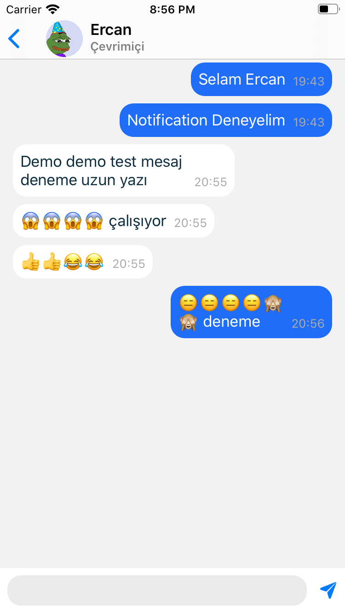

# XuChat
> Real time chat application with Firebase

## Features

- Push Notification
- Online/Ofline User Status
- Last Seen
- Writing Status
- Last Messages
- Check Room Control

## Video
[](https://www.youtube.com/watch?v=QrcmAHae_BA)

## Images

       


## Design Pattern
- MVVM


## Requirements

- iOS 10+
- Xcode 11.0+


## CocoaPods

```ruby
pod 'Firebase/Auth'
pod 'Firebase/Firestore'
pod 'FirebaseFirestoreSwift'
pod 'Firebase/Analytics'
pod 'Firebase/Messaging'
pod 'JGProgressHUD'
pod 'Firebase/Storage'
pod 'Kingfisher', '~> 5.14'
```

## Contact

Ercan Garip – [Linkedin](https://www.linkedin.com/in/ercangarip/) – ercangp34@gmail.com
